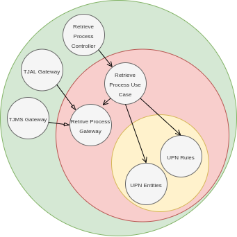

# jusbrasil-process-search-api

## Objetivos do Projeto

- implementação do [Desafio Backend Enginner - Jusbrasil](https://gist.github.com/tarsisazevedo/966d469e8a80741334d3c4dce66cbea5);
- criar um repositório de exemplo com implementação de [Clean Architecture](https://blog.cleancoder.com/uncle-bob/2012/08/13/the-clean-architecture.html) em Java;
- praticar os princípios de TDD, conforme proposto pelo Robert C. Martin [nessa palestra](https://www.youtube.com/watch?v=58jGpV2Cg50&list=PLJxaxbiDu_CIDjGndHcoXrg-ockNem27L&index=6&t=1300s&ab_channel=UnityCoin);
- criar um repositório fácil de rodar, com criação de imagem Docker e Docker Compose, permitindo subir o serviço com cache local ou distribuído;

## Tecnologias
- Java 11
- Maven
- Docker

## Arquitetura

O uso de arquitetura limpa (Clean Architecture) ajudaria em diversos aspectos:

- ajuda no desenvolvimento de classes mais desacopladas e mais testáveis;
- ajudaria a separar os detalhes de implementação, como o funcionamento dos crawlers, que são detalhes complexos de baixo nível;
- o isolamento da implementação dos crwalers ajudaria a facilitar a substituição destes casos as páginas HTML da consulta dos processos mude de forma significativa para algum tribunal;
- o isolamento da implementação dos crawlers ajudaria na substituição por consultas mais modernas por parte dos tribunais, se viessem a existir (API REST, por exemplo);
- o isolamento da implementação dos crawlers ajudaria na inclusão de novos crawlers para novos tribunais, se fosse necessário;
- o isolamento da parte web ajudaria o sistema ser facilmente adaptável a outros meios de interação, embora improvavél;
- a separação dos detalhes de implementação nos ajuda a focar nas regras de negócio e deixar as implementações de mais baixo nível por úlitmo;

### Clean Architecture

O sistema será separado em 4 camadas:
- domain: regras de negócio;
- application: regras da aplicação e controle de fluxo;
- adapter: implementações de acessos externos, definidos por interfaces na camada application: cache distribuído, crawlers, camada web, etc;
- main: configurações referentes ao startup da applicação e frameworks;

Aqui, a regra mais importante a ser seguida é a regra da dependência, que diz que uma camada mais externa pode depender de camadas mais internas mas camadas internas nunca podem depender de uma camada mais externa, gerando o seguinte fluxo de dependência:

main -> adapter -> application -> domain

A camada mais interna, em amarelo, é a camada de domínio (domain) e é onde estarão as entidades e regras de negócio. Exemplos são as classes que representam um número de processo (Numeração ùnica de Processos) e todas as classes envolvidas na sua validação.

A camada intermediária, em vermelho, é a camada de aplicação (application) e é responsável pelo fluxo das informações. Ela será chamada pela camada externa (um controller, da camada web, por exemplo) e fará as validações e conversões para o número do processo (conforme Numeração Única de Processos), realizará a requisição para o gateway (interface) que busca o pocesso e retorna esses valores para a camada que inicou o processo. Aqui também estará o gateway mencionado, que define uma interface para busca de processos baseado na Numeração Única de Processos.

A camada externa, em verde, representa os adapters. Aqui estarão presentes todas as implementações de mais baixo nível, responsáveis por interações ou bibliotecas externas. Teremos uma implementação para busca do processo via crawler (talvez uma para cada tribunal), teremos uma implementação que fará cacheamento e teremos a entrada via camada web.

A camada main, não representada no diagrama, será responsável pelas configurações do serviço, como framework (Spring), cache e startup da aplicação.

## Implementação

### Padrão CNJ para Numeração de Processos Jurídicos: Numeração Única de Processos

- 20 dígitos
- formato NNNNNNN-DD.AAAA.J.TR.OOOO
- NNNNNNN; 7 dígitos; número seqüencial anual por unidade de origem;
- DD; 2 dígitos; dígito verificador (algoritmo Módulo 97 Base 10, conforme Norma ISO 7064:2003, nos termos das instruções constantes do Anexo VIII desta Resolução.); Fórmula: 98 - ((n * 100) % 97), onde n é o número NNNNNNNAAAAJTROOOO;
- AAAA; 4 dígitos; ano do ajuizamento do processo;
- J; 1 dígito; órgão ou segmento do Poder Judiciário; de 1 a 9. A API aceitará somente 8 (Justiça dos Estados e do Distrito Federal e Territórios);
- TR; 2 dígitos; tribunal do respectivo segmento do Poder Judiciário e, na Justiça Militar da União, a Circunscrição Judiciária; de 0 a 27 ou 90; Para A API serão aceitos os valores 02 e 12;
- OOOO; 4 dígitos; unidade de origem do processo; de 0 a 9999;
